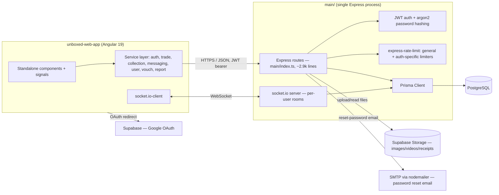
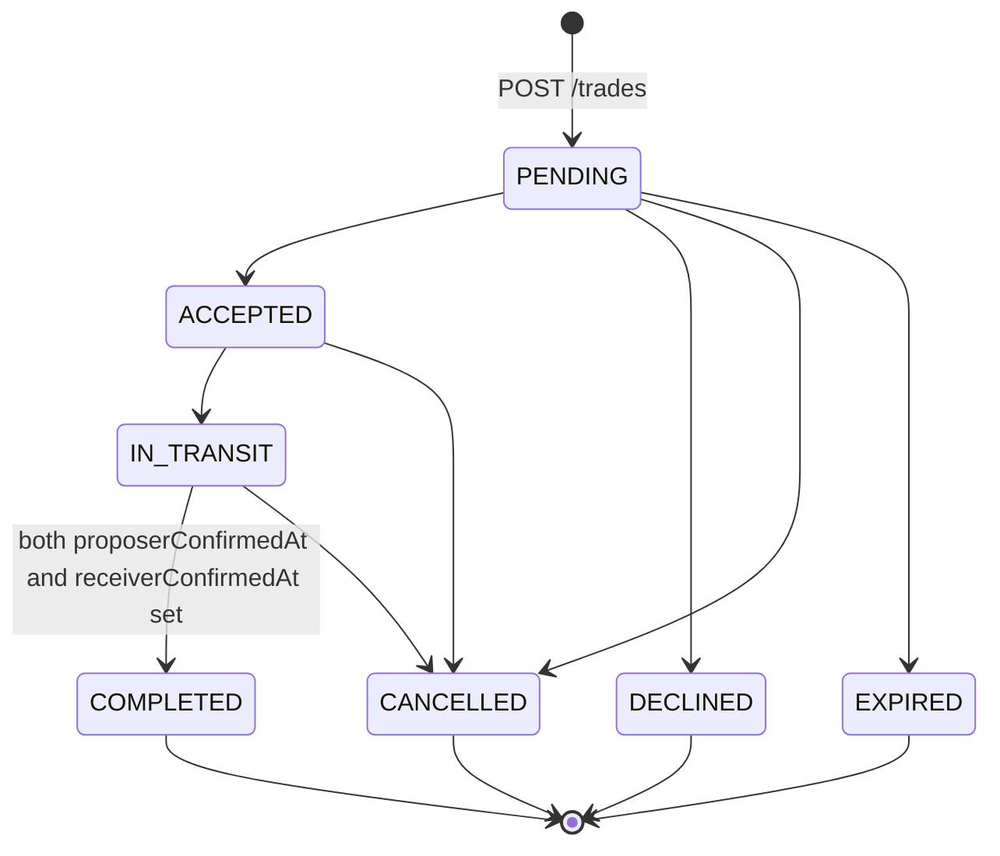
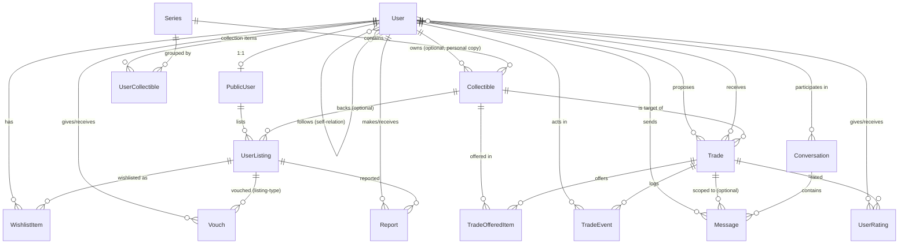

# unboxd. — Architecture & Data Models

**Last updated**: 2026-08-22
**Scope**: This document describes the system *as implemented* in `main/` (backend) and `unboxed-web-app/` (frontend), verified against `main/prisma/schema.prisma` and `main/index.ts` directly. Where it references product intent rather than shipped code, that's called out explicitly. For the product rationale behind these systems, see `PRD.md`; for algorithm/complexity framing, see the root `README.md`.

---

## 1. System Overview

**Backend is a single Express process, not microservices.** All ~45 REST routes and the Socket.io server live in one file, `main/index.ts`, sharing one Prisma client (`main/lib/prisma.ts`). This is a deliberate current-state simplification (see `guidelines.md` §7: "monolith for now — future refactor to route modules"), not an oversight.

**Two independent identity paths exist on the same `User` row**: email/password (argon2-hashed, JWT-issued by the Express backend) and Google OAuth (handled by Supabase Auth, landing on `/auth/callback`). Both resolve to the same `users/sync` endpoint to reconcile a `User` + `PublicUser` record.

**File storage is fully offloaded to Supabase Storage** — the backend never persists uploaded binaries to local disk; `multer` buffers uploads in memory (`multer({ storage: multer.memoryStorage() })`) and `services/storage.service.ts` streams them to Supabase, returning a public URL that's stored as a string column (`imageUrl`, `receiptUrl`, `demoVideoUrl`, `profilePicture`).

**Local dev database**: `docker-compose.yml` at repo root spins up Postgres 16 on host port 5433 (container `unboxed-postgres-dev`) for local development, matching the `postgresql` provider in `schema.prisma`. Note `main/dev.db` also exists in the tree (SQLite) — that's a leftover from an earlier local setup, not the active datasource; `DATABASE_URL` in `.env` drives Prisma, and the schema's provider is `postgresql`.

---

## 2. Backend Request Lifecycle

1. `express.json()` parses the body.
2. `generalLimiter` (300 req / 15 min per IP) applies globally via `app.use()`.
3. Auth-sensitive routes (`/auth/register`, `/auth/login`, `/auth/reset-password`) additionally pass through `authLimiter` (5 req / 15 min, successful requests excluded from the count). `/auth/forgot-password` gets its own `forgotPasswordLimiter` — it always returns `200` regardless of whether the email exists (to avoid account enumeration), so it can't rely on `skipSuccessfulRequests` and needs an independent limiter.
4. Route handler runs, using `prisma` directly (no repository/DAO layer — routes call the Prisma client inline).
5. Where a change matters to a live counterparty (trade created, trade status changed, checklist updated, confirmation recorded, chat message sent), the handler emits a Socket.io event to that user's room (`user_{id}`) *after* the DB write succeeds.
6. Errors are caught per-route and returned as `{ error: string }` with an appropriate HTTP status — there's no centralized error-handling middleware.

There is no JWT-verification middleware guarding routes centrally — most routes trust `userId`/`actorId` values passed in the request body or params rather than deriving identity from a verified token. Where authorization does exist, it's inline (e.g. trade update endpoints check `actorId === trade.proposerId || actorId === trade.receiverId`). This is a real gap worth flagging: nothing stops a client from passing someone else's `userId` on most endpoints today.

---

## 3. Real-Time Infrastructure (Socket.io)

Single `Server` instance attached to the same HTTP server as Express (`createServer(app)`), CORS-scoped to `FRONTEND_URL`.

**Rooms**: clients call `join_user(userId)` to join `user_{userId}` — this is how per-user push notifications work (no auth check on join; any connected socket can join any user's room by ID today).

**Events emitted by the server**:
| Event | Trigger | Room |
|---|---|---|
| `trade:created` | `POST /trades` | proposer's and receiver's `user_{id}` |
| `trade:status` | `PATCH /trades/:id` (status transition) | proposer's and receiver's `user_{id}` |
| `trade:checklist` | `PATCH /trades/:id/checklist` | (per trade participants) |
| `trade:confirmation` | `PATCH /trades/:id/confirm` | proposer's and receiver's `user_{id}` |
| `new_message` | client emits `send_message` | `conversation_{id}` room (broadcast + echo to sender) |

**Chat messages are optimistic-first**: `send_message` broadcasts the message payload immediately (with a throwaway client-side `id: Math.random()`), then persists to `Message` + bumps `Conversation.updatedAt` in the background. If persistence fails, the emitted message is not rolled back on connected clients — the UI can show a message that never made it to the DB.

---

## 4. Trade State Machine

Transitions are whitelisted in code via `TRADE_STATUS_TRANSITIONS` (a `from → Set<to>` map) and enforced in `PATCH /trades/:id` through `canTransitionStatus()`. Any transition not in the map is rejected with `400`.

**`COMPLETED` cannot be reached through `PATCH /trades/:id`** — that route explicitly rejects an attempt to set status to `COMPLETED` and tells the caller to use `PATCH /trades/:id/confirm` instead. Completion is a **dual-confirmation** flow, not a single status write:
1. Trade must already be `IN_TRANSIT`.
2. Either party calls `/confirm`, which stamps `proposerConfirmedAt` or `receiverConfirmedAt` (whichever role the `actorId` maps to).
3. Once *both* timestamps are set, the same handler performs a second guarded update flipping `status` to `COMPLETED`.

**Optimistic concurrency** is enforced identically in both `/trades/:id` and `/trades/:id/confirm`: the update is a `prisma.trade.updateMany({ where: { id, version: guardVersion, ...status guard } })`. If the row's current `version` (or `status`, for the plain status-update route) doesn't match what the caller last saw, `updateMany` matches zero rows, and the handler returns `409` — the client is expected to refetch and retry. `version` increments by 1 on every successful write (status change, checklist update, or confirmation), so it's a single monotonic guard across all trade mutations, not just status.

**Every transition and confirmation is logged** to `TradeEvent` (`type: 'STATUS' | 'CONFIRMATION'`, `fromStatus`/`toStatus`, `actorId`, free-text `note`) — this is the audit trail for dispute resolution referenced in the PRD.

**Verification checklist**: `Trade.proposerChecklist` / `receiverChecklist` are `Json` columns (each side has its own independent checklist, defaulting to `DEFAULT_TRADE_CHECKLIST` — 5 boolean fields: `reviewsChecked`, `meetupArranged`, `itemInspected`, `proofRequested`, `authenticityVerified`). `computeVerificationStatus()` derives `not_started` / `in_progress` / `verified` from how many of the 5 booleans are true (`verified` requires all 5). This is stored redundantly as `proposerVerificationStatus`/`receiverVerificationStatus` string columns rather than always computed — the string can drift from the checklist JSON if one is updated without the other, so treat the checklist JSON as the source of truth.

**Known gap vs. product intent**: neither `/trades/:id` nor `/trades/:id/confirm` writes to `UserCollectible` on reaching `COMPLETED`. The PRD's "collections update automatically" requirement is **not yet implemented** — grep confirms no `userCollectible` write anywhere near the trade-completion code path today.

---

## 5. Swap Matching (Triangular Suggestions)

`GET /swaps/suggestions/:userId` — computed on-demand per request, no caching or precomputed graph.

**Inputs**:
- `has`: every `UserListing` where `isAvailableForTrade: true` and `collectibleId` is set (i.e., linked to a real `Collectible`, not just a freeform listing).
- `wants`: every `WishlistItem`, resolved through its `UserListing.collectibleId` to get the underlying collectible each user wants.

**Algorithm** (matches the `README.md` description, verified against the actual implementation):
1. Build `listingsByUser` (userId → their listings) and `listingByUserCollectible` (`"userId:collectibleId"` → listing) maps for O(1) lookup.
2. Build `wantsByUser` (userId → `Set<collectibleId>`).
3. For the target user A: for every other listing B whose collectible is in A's want-set, and every other listing C (≠ A, ≠ B) whose collectible is in B's owner's want-set, check whether C's owner wants something A has (via `listingByUserCollectible` lookup). If so, that's a closed 3-cycle: **B → A** (B gives A what A wants), **C → B**, **A → C**.
4. Deduplicate via a `seen` set keyed on `targetUserId:listingA.id:listingB.id:listingC.id`.
5. Stop early once `limit` (query param, default 10, capped at 50) suggestions are collected.

**Complexity**: the two nested loops over all listings make this O(L²) in the worst case per request (L = total available listings), as noted in `README.md`. There's no memoization or incremental index — every call recomputes from scratch. This is fine at current data volumes; it's the first thing to revisit if listing volume grows.

**What it does *not* do**: no 1:1 direct-match endpoint exists separately — the PRD's "direct matches" pillar isn't a distinct implemented feature today; only the 3-party cycle search is implemented as `/swaps/suggestions`.

---

## 6. Auth & Identity

- **Password auth**: `argon2` hash stored on `User.password`. `POST /auth/login` issues a JWT (`JWT_SECRET`, no expiry configured in the visible code path). `POST /auth/register` creates `User`.
- **Password reset**: `resetToken` + `resetTokenExpiry` columns on `User`; `forgot-password` always responds `200` to avoid leaking account existence; reset email sent via `nodemailer` over SMTP.
- **OAuth**: Google sign-in goes through Supabase Auth client-side, redirects to `/auth/callback`, then reconciles into the same `User`/`PublicUser` pair via `POST /users/sync`.
- **Frontend guard**: `authGuard` (functional-style class, `canActivate`) checks `AuthService.isAuthenticated()` and redirects to `/login` if not authenticated; applied to every route except the auth pages and `/home` in `app.routes.ts`.
- **User vs. PublicUser split**: `User` holds private/auth data (email, password hash, reset tokens) and rating aggregates; `PublicUser` (same `id`, 1:1) holds what's safe to expose on profiles (name, bio, avatar, verification badge, `vouchCount`). Listings (`UserListing`) hang off `PublicUser`, not `User` — API responses for listings/trades intentionally join through `PublicUser` to avoid leaking private fields.

---

## 7. Frontend Architecture (Angular 19)

- **Standalone components** throughout, no `NgModule`s (per `guidelines.md` conventions, confirmed in `app.routes.ts` — components imported directly).
- **State**: Angular Signals (`signal()`, `computed()`, `effect()`), not NgRx or a similar store.
- **Routing** (`src/app/app.routes.ts`): every route guarded by `authGuard` except `/login`, `/register`, `/forgot-password`, `/reset-password`, `/auth/callback`, and `/home` (the latter a known dead Supabase-test page per `CLAUDE.md`). Default route redirects to `/browse`; unmatched paths also fall back to `/browse`.
- **Service layer** (`src/app/services/`): one service per domain — `auth`, `trade`, `collection`, `messaging`, `user`, `vouch`, `report`, plus `supabase.service.ts` for the Supabase JS client (storage reads, OAuth). Services own `HttpClient` calls and Socket.io client wiring; page components consume services rather than calling `HttpClient` directly.
- **Components** (`src/app/components/`): shared/presentational — `trade-card`, `trade-grid`, `trade-modal`, `navbar`, `sidebar-filters`, `category-tabs`, `chat`, `advertisement-card`. Pages (`src/app/pages/`) are the "smart" components that orchestrate services + these presentational pieces, per the smart/presentational split documented in `guidelines.md`.

---

## 8. Data Model

### 8.1 Model reference

| Model | Purpose | Notable fields / constraints |
|---|---|---|
| `User` | Private account record | `email`/`username` unique; `password` (argon2 hash); `resetToken`/`resetTokenExpiry`; `ratingAvg`/`ratingCount` aggregates; self-relation `User_A`/`User_B` implements follow graph |
| `PublicUser` | Public-safe profile, `id` shared 1:1 with `User` | `vouchCount`; `username` unique (separately from `User.username`); owns `UserListing`s |
| `Series` | A collectible series (e.g. Dimoo World x Disney) | `name` unique; `totalItems` for completion-% math |
| `Collectible` | A specific figure definition within a series | `rarity`, `referenceValue`; optional `userId` — a `Collectible` row can represent a specific user's personal copy, not just a catalog entry (unusual: catalog and instance are conflated in this model) |
| `UserCollectible` | A collection entry for a user (what My Collection renders) | `quantity` (tracks duplicates directly as a count, not separate rows); `condition` enum; `receiptUrl`/`demoVideoUrl`/`serialNumber` for provenance |
| `UserListing` | A marketplace listing (Browse feed item) | `status` (`AVAILABLE`/`SOLD`), `isAvailableForTrade`, `dealMethods: String[]`, `vouchCount`; `collectibleId` optional — a listing can exist without linking to a catalog `Collectible` (freeform listings are invisible to swap matching, since matching requires `collectibleId`) |
| `Trade` | A structured trade proposal/offer between two users | `proposerId`/`receiverId`/`targetItemId`; `status` (`TradeStatus` enum); `version` (optimistic concurrency); `cashAmount`/`buyerPaysCash` (cash top-up support beyond pure swap); dual checklist + verification-status + confirmation timestamp fields (see §4) |
| `TradeOfferedItem` | Join table: which `Collectible`s were offered in a `Trade` | No `quantity` — one row per offered item |
| `TradeEvent` | Append-only audit log of trade transitions | `type` (`'STATUS' \| 'CONFIRMATION'`), `fromStatus`/`toStatus`, `actorId` (nullable — system-driven completion has no actor), free-text `note` |
| `WishlistItem` | "I want this listing" | Unique on `(userId, listingId)` — can't wishlist the same listing twice; wishlisting a *listing* (not a raw collectible) is what feeds `wantsByUser` in matching |
| `Conversation` / `Message` | Chat | `Message.tradeId` optional — messages can be trade-scoped or general-conversation-scoped; `Conversation.users` is many-to-many via implicit join table |
| `UserRating` | Post-trade rating | Unique on `(tradeId, raterId)` — one rating per rater per trade, both directions possible |
| `Vouch` | Trust signal on a user or a listing | `type: VouchType` (`USER`/`LISTING`) discriminates which target field (`userId` vs `listingId`) applies; two partial-unique constraints prevent double-vouching the same target by the same author |
| `Report` | Flag a user or listing | `status: ReportStatus` (`PENDING`/`REVIEWED`/`RESOLVED`/`DISMISSED`) — moderation workflow exists at the data level; no admin UI consumes it yet (per `guidelines.md` backlog) |

### 8.2 Modeling decisions worth knowing before extending this schema

- **`Collectible.userId` is a trap for the unwary**: it's easy to assume `Collectible` is a pure catalog table (like `Series`), but it's overloaded to also represent a specific user's owned instance in some code paths. Don't assume `Collectible` rows are user-agnostic without checking `userId`.
- **Duplicates are a `quantity` int on `UserCollectible`, not separate rows.** "Which specific unit got traded" isn't tracked — trading decrements/updates a `UserCollectible`, it doesn't reference one specific physical unit.
- **Matching only sees `Collectible`-linked listings.** A `UserListing` with `collectibleId: null` is a valid, visible marketplace listing but is invisible to `/swaps/suggestions` (both the `has` and `wants` sides of matching require `collectibleId`). Freeform listings opt out of triangular matching by construction.
- **`Vouch` and `Report` exist in the schema and are two current-sprint priorities per `guidelines.md`**, but note they're **not** documented in the older `guidelines.md` "Core Models" table — that table has drifted from the actual schema (it also omits `TradeEvent`, and understates `Trade`'s checklist/confirmation/cash fields as a separate concept). Treat `main/prisma/schema.prisma` as the single source of truth over any prose summary, including this document — re-diff against it if this file goes stale.

---

## 9. Known Architectural Rough Edges

Documented here rather than silently worked around, so future changes don't accidentally paper over them:

1. **No centralized auth/authorization middleware** — most routes trust body/param `userId` rather than a verified token identity. Fine for a prototype, a real gap before any multi-tenant trust boundary matters.
2. **Trade completion doesn't sync `UserCollectible`** — the core "duplicates become missing pieces" loop stops at `Trade.status = COMPLETED`; nothing moves items between users' collections automatically yet.
3. **Socket `join_user` has no auth check** — any client can join any `user_{id}` room by guessing/knowing an ID and receive that user's real-time trade/chat events.
4. **Chat messages are optimistic with no rollback** — a message can appear in the UI and never persist if the background `prisma.message.create` fails.
5. **`main/index.ts` is a ~2,900-line monolith** with no route modules, no service/repository layer, and inline Prisma calls throughout — acknowledged as intentional-for-now in `guidelines.md`.
6. **Swap matching is fully recomputed per request**, O(L²) worst case, no caching layer — acceptable at current scale, first thing to revisit under load.
7. **`main/dev.db` (SQLite) sits alongside the Postgres-based `schema.prisma`/`docker-compose.yml`** — leftover artifact, not part of the active data path; worth deleting in a cleanup pass so it doesn't confuse future setup.
